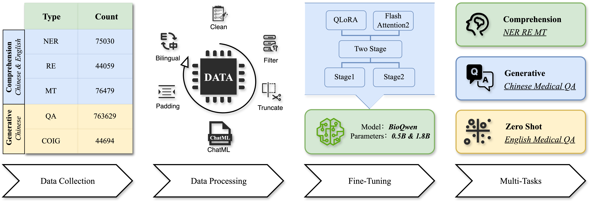

# README

## Title

**BioQwen: A Small-Parameter, High-Performance Bilingual Model for Biomedical Multi-Tasks**



## Prerequisites

- Python 3.8 or higher
- PyTorch
- bitsandbytes
- gradio
- datasets
- transformers
- peft
- trl

Install the required packages using:
```bash
pip install -r requirements.txt
```

## Directory Structure

```
.
├── code/
│   ├── img/
│   └── notebook/
│       ├── BioQwen-manuscript.ipynb
│       └── README.md
├── result/
│   ├── ner/
│   │   ├── bc5cdr/
│   │   ├── cmeee/
│   │   └── ncbi/
│   └── qa/
│       ├── cmedqa2/
│       ├── icliniq/
│       └── webmedqa/
├── script/
│   ├── README.md
│   ├── script_stage1.py
│   └── script_stage2.py
├── README.md
└── requirements.txt
```

## Description of Contents

### code/

- **img/**: Contains image files related to the project.
- **notebook/**: Contains Jupyter notebooks for detailed exploration and documentation.
  - `BioQwen-manuscript.ipynb`: Notebook detailing the model training and inference process.
  - `README.md`: Documentation for the notebook.

### result/

- **ner/**: Results and outputs related to Named Entity Recognition tasks.
  - **bc5cdr/**: Results for the BC5CDR dataset.
  - **cmeee/**: Results for the CMEEE dataset.
  - **ncbi/**: Results for the NCBI dataset.
- **qa/**: Results and outputs related to Question Answering tasks.
  - **cmedqa2/**: Results for the CMEDQA2 dataset.
  - **icliniq/**: Results for the iCliniq dataset.
  - **webmedqa/**: Results for the WebMedQA dataset.

### script/

- **README.md**: Documentation for the scripts.
- **script_stage1.py**: Script for Stage 1 training.
- **script_stage2.py**: Script for Stage 2 training.

### README.md

This file, providing an overview and instructions for the repository.

### requirements.txt

File listing all the dependencies required to run the scripts and notebooks in this repository.

## Training

The training is performed in two stages using the scripts provided.

### Stage 1 Training

1. **Load and Filter Data:**
    - Load datasets from various sources.
    - Filter and preprocess the data.
    - Tokenize the data with language checks.

2. **Model Setup:**
    - Load the pre-trained model and tokenizer.
    - Configure BitsAndBytes for efficient training.
    - Prepare the model for QLoRA/LoRA training.

3. **Training Configuration:**
    - Define training arguments.
    - Create a Trainer instance and start training.

### Stage 2 Training

1. **Load and Filter Data:**
    - Load additional datasets.
    - Concatenate datasets for stage 2 training.
    - Tokenize the data with language checks.

2. **Model Setup:**
    - Load the model from stage 1.
    - Configure BitsAndBytes for efficient training.
    - Prepare the model for QLoRA/LoRA training.

3. **Training Configuration:**
    - Define training arguments.
    - Create a Trainer instance and start training.

## Running the Training

### Single GPU

To run the training on a single GPU, use the `python` command:

```bash
python script/script_stage1.py
python script/script_stage2.py
```

### Multiple GPUs

To run the training on multiple GPUs, use the `torchrun` command:

```bash
torchrun --nproc_per_node=NUM_GPUS script/script_stage1.py
torchrun --nproc_per_node=NUM_GPUS script/script_stage2.py
```

Replace `NUM_GPUS` with the number of GPUs available on your machine.

## Contact

For any questions or further information, please submit an issue on this repository.